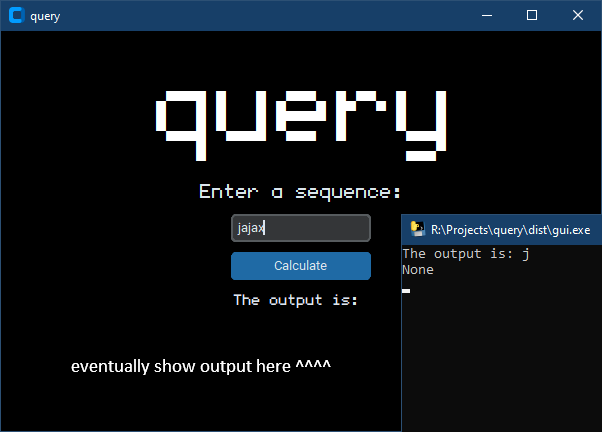

# query

[based off a silly music video](https://www.youtube.com/watch?v=3QUQbJsBxo0)

what is today's query?

<p align="center">

</p>

# Rules
X, J, and Q are considered inputs. O and A are what I'm calling output modifiers. And I'm calling these together (e.g. QAXOJ) a sequence.

- If there is no modifier, then the output is whatever input appeared the most. 
- If there is an O modifier, the output is the input that appears the most in the sequence.
- If there is an A modifier, the output is the input that appears the least in the sequence.
- If there is both an A and O modifier, then the O modifier takes priority and looks for the input that appears the most in the sequence.
- If there is ONLY A or O modifiers, the output is the first modifier in the sequence.
- Q is not a modifier, however if Q is anywhere in the sequence then the output is always Q.

# building
1. install customtkinter and pyinstaller:
- pip install customtkinter  
- pip install pyinstaller

2. run: `pyinstaller gui.py -F --noconfirm --onefile --hidden-import=customtkinter --add-data "c:/users/<username>/appdata/local/programs/python/python38/lib/site-packages/customtkinter;customtkinter/"`

# credit
[**SixBeeps**](https://www.youtube.com/@sixbeeps) for the idea  
[**customtkinter**](https://github.com/TomSchimansky/CustomTkinter) team for the UI  
the [**undefined medium**](https://github.com/andirueckel/undefined-medium) team for the font  

# todo (probably never)
* implement random sequence generator into the app
* try to solve the query yourself (given a random query, guess the answer)
* stop the output from showing 2 lines (answer then 'None' for some reason)
* actually show the output in the program instead of only in the terminal

# random sequences

```
ojjqx  
oxxxq  
qjajo  
jajax  
oajax  
ajaqj  
xoaaa  
ooxxa  
aoxox  
xxxaq  
xjxoa  
xaxoo  
qjjxj  
ojxaa  
ooqao  
ooojq  
xooaa  
jojjo  
qajaa  
```